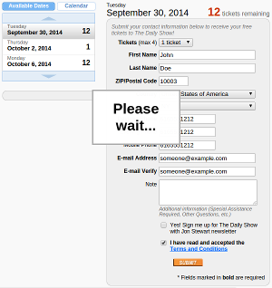

# Colbert Ticket Bot

A simple program that automates finding and registering for tickets to Comedy
Central shows, like the Colbert Report and The Daily Show, via their web site.



## Why?

There is already a twitter feed Spiffomatic64, or @DailyTix, that provides
a real-time view of available tickets for the Colbert Report and the Daily
Show. What purpose does this serve?

Well, after a number of attempts to snag tickets by clicking the link
and filling out the form only to see that the tickets were already taken,
I decided to change my strategy. Colbert tickets seem to be scarce these days, 
and while the twitter feed is helpful in identifying when there are tickets,
it doesn't do much to help you register for them. You can think of the twitter
bot as radar, allowing you to see when there are tickets. This program is a
guided missile, which will both detect and get the tickets for you.

Use this program if you want to get tickets the first time, for the right date,
without ever having to monitor twitter.


## Requirements

To run this program, you'll need:

  * A working Python 2 environment
  * Google Chrome Web Browser
  * [ChromeDriver](https://code.google.com/p/selenium/wiki/ChromeDriver)

## Setup

To run the program, you just need to install the dependencies. This should be
as simple as running:

```
pip install -r requirements.txt
```

## Configuration

To configure the application, you can use the supplied config.ini-example.
Just edit the config to reflect values relevant to you and rename it to
config.ini. Once you do this, you should be ready to run the bot.

## Running

To run the bot, you just need to run:

```
./colbertix.py
```

The bot will search for tickets based on the information you provided in the
config file, and will stop once it has successfully registered for tickets. It
will also take a screen shot of the state of the application immediately 
following registration for your reference.
